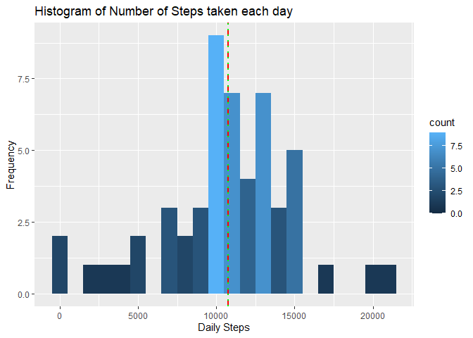
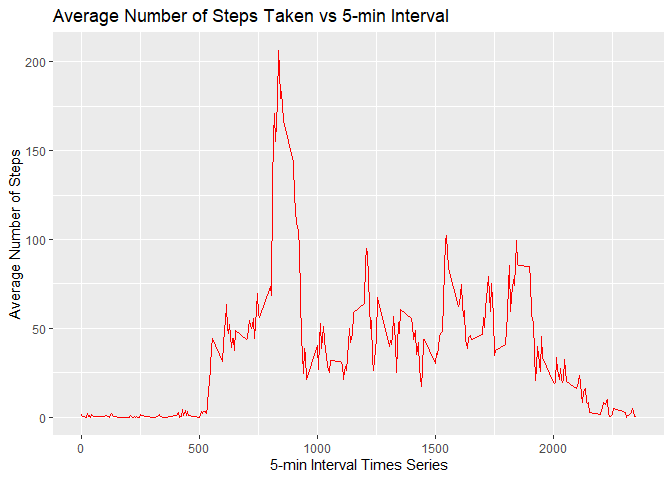
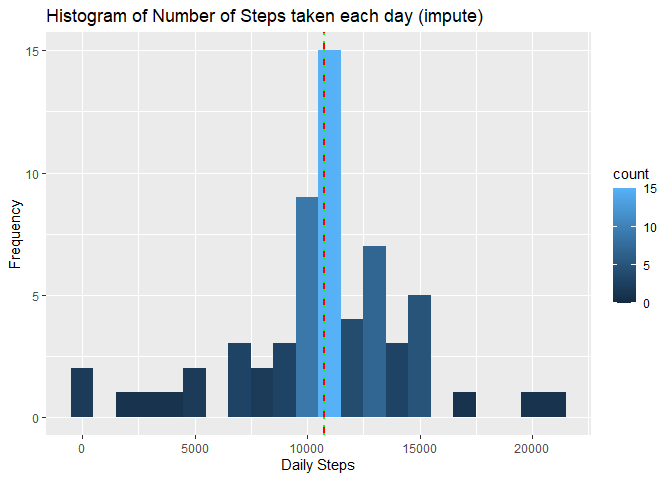
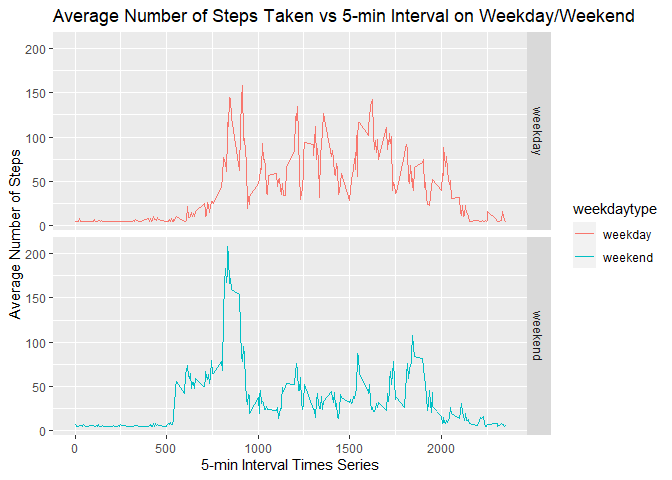

# Part 1 Loading and preprocessing the data
Show any code that is needed to

    Load the data (i.e. read.csv())

    Process/transform the data (if necessary) into a format suitable for your analysis


```r
## Set correct working directory (file already unzipped), load unprocessed data
setwd("C:/Users/Akis/Desktop/R Coursera/Reproducible research/repdata_data_activity")

data <- read.csv("activity.csv")

##Load necessary libraries
library("data.table")
```

```
## Warning: package 'data.table' was built under R version 3.6.3
```

```r
library(ggplot2)
```

```
## Warning: package 'ggplot2' was built under R version 3.6.3
```

```r
library(dplyr)
```

```
## Warning: package 'dplyr' was built under R version 3.6.3
```

```
## 
## Attaching package: 'dplyr'
```

```
## The following objects are masked from 'package:data.table':
## 
##     between, first, last
```

```
## The following objects are masked from 'package:stats':
## 
##     filter, lag
```

```
## The following objects are masked from 'package:base':
## 
##     intersect, setdiff, setequal, union
```

```r
library(lubridate)
```

```
## Warning: package 'lubridate' was built under R version 3.6.3
```

```
## 
## Attaching package: 'lubridate'
```

```
## The following objects are masked from 'package:data.table':
## 
##     hour, isoweek, mday, minute, month, quarter, second, wday, week,
##     yday, year
```

```
## The following objects are masked from 'package:base':
## 
##     date, intersect, setdiff, union
```

```r
library(knitr)
```

```
## Warning: package 'knitr' was built under R version 3.6.3
```

```r
opts_chunk$set(fig.path = "./figure/")

##Clean up dataset and create new variables
data1 <- na.omit(data)
summary(data1)
```

```
##      steps                date          interval     
##  Min.   :  0.00   2012-10-02:  288   Min.   :   0.0  
##  1st Qu.:  0.00   2012-10-03:  288   1st Qu.: 588.8  
##  Median :  0.00   2012-10-04:  288   Median :1177.5  
##  Mean   : 37.38   2012-10-05:  288   Mean   :1177.5  
##  3rd Qu.: 12.00   2012-10-06:  288   3rd Qu.:1766.2  
##  Max.   :806.00   2012-10-07:  288   Max.   :2355.0  
##                   (Other)   :13536
```

```r
str(data1)
```

```
## 'data.frame':	15264 obs. of  3 variables:
##  $ steps   : int  0 0 0 0 0 0 0 0 0 0 ...
##  $ date    : Factor w/ 61 levels "2012-10-01","2012-10-02",..: 2 2 2 2 2 2 2 2 2 2 ...
##  $ interval: int  0 5 10 15 20 25 30 35 40 45 ...
##  - attr(*, "na.action")= 'omit' Named int  1 2 3 4 5 6 7 8 9 10 ...
##   ..- attr(*, "names")= chr  "1" "2" "3" "4" ...
```

```r
data$date <- ymd(data$date)
data$monthly <- as.numeric(format(data$date, "%m"))
data$daily <- as.numeric(format(data$date, "%d"))
```


# Part 2 What is mean total number of steps taken per day?
For this part of the assignment, you can ignore the missing values in the dataset.


    Calculate and report the mean and median total number of steps taken per day
This means I will use data1 dataset


```r
#steps each day
data2 <- summarize(group_by(data1,date),daily.step=sum(steps))
```

```
## `summarise()` ungrouping output (override with `.groups` argument)
```

```r
#mean
mean.activity <- as.integer(mean(data2$daily.step))
mean.activity
```

```
## [1] 10766
```

```r
#median
median.activity <- as.integer(median(data2$daily.step))
median.activity
```

```
## [1] 10765
```
The mean total number of steps taken per day is 10766.

The median total number of steps taken per day is 10765.

    Make a histogram of the total number of steps taken each day
    

```r
# Plot histogram
plot.steps.day <- ggplot(data2, aes(x=daily.step)) + 
  geom_histogram(binwidth = 1000, aes(y=..count.., fill=..count..)) + 
  geom_vline(xintercept=mean.activity, colour="red", linetype="dashed", size=1) +
  geom_vline(xintercept=median.activity, colour="green" , linetype="dotted", size=1) +
  labs(title="Histogram of Number of Steps taken each day", y="Frequency", x="Daily Steps") 
plot.steps.day
```

<!-- -->


# Part 3 What is the average daily activity pattern?

    Make a time series plot (i.e. type = "l") of the 5-minute interval (x-axis) and the average number of steps taken, averaged across all days (y-axis)

    Which 5-minute interval, on average across all the days in the dataset, contains the maximum number of steps?


```r
##Make a time series plot (i.e. type = "l") of the 5-minute interval (x-axis) and the average number of steps taken, averaged across all days (y-axis)

data3 <- data1 %>% group_by(interval) %>% summarize(mean.step=mean(steps))
```

```
## `summarise()` ungrouping output (override with `.groups` argument)
```

```r
plot.step.interval <- ggplot(data3, aes(x=interval,y=mean.step)) + 
    geom_line(color="red") + 
    labs(title="Average Number of Steps Taken vs 5-min Interval", y="Average Number of Steps", x="5-min Interval Times Series")
plot.step.interval
```

<!-- -->

```r
##Which 5-minute interval, on average across all the days in the dataset, contains the maximum number of steps?
maxstep <- which.max(data3$mean.step)
maxstep2 <- data3$interval[maxstep]

sprintf("Maximum number of steps is coming from %gth 5-min interval", maxstep2)
```

```
## [1] "Maximum number of steps is coming from 835th 5-min interval"
```


# Part 4 Imputing missing values
Note that there are a number of days/intervals where there are missing values (coded as NA). The presence of missing days may introduce bias into some calculations or summaries of the data.

    Calculate and report the total number of missing values in the dataset (i.e. the total number of rows with NAs)

```r
# Total number of missing values in the dataset
sum(is.na(data))
```

```
## [1] 2304
```
 The total number of missing values in the dataset is 2304 
 
    Devise a strategy for filling in all of the missing values in the dataset. The strategy does not need to be sophisticated. For example, you could use the mean/median for that day, or the mean for that 5-minute interval, etc.

I am going to replace NA values with the mean for the day, so:

```r
#first I am going to copy the dataset so that I don't mess up with the original one
impute.activity <- data
impute.activity$steps[is.na(impute.activity$steps)] <- mean(impute.activity$steps,na.rm=TRUE)
impute.activity$steps <- as.numeric(impute.activity$steps)
impute.activity$interval <- as.numeric(impute.activity$interval)

#to make sure it has worked:
summary(impute.activity)
```

```
##      steps             date               interval         monthly     
##  Min.   :  0.00   Min.   :2012-10-01   Min.   :   0.0   Min.   :10.00  
##  1st Qu.:  0.00   1st Qu.:2012-10-16   1st Qu.: 588.8   1st Qu.:10.00  
##  Median :  0.00   Median :2012-10-31   Median :1177.5   Median :10.00  
##  Mean   : 37.38   Mean   :2012-10-31   Mean   :1177.5   Mean   :10.49  
##  3rd Qu.: 37.38   3rd Qu.:2012-11-15   3rd Qu.:1766.2   3rd Qu.:11.00  
##  Max.   :806.00   Max.   :2012-11-30   Max.   :2355.0   Max.   :11.00  
##      daily      
##  Min.   : 1.00  
##  1st Qu.: 8.00  
##  Median :16.00  
##  Mean   :15.75  
##  3rd Qu.:23.00  
##  Max.   :31.00
```

    Create a new dataset that is equal to the original dataset but with the missing data filled in.

Same as before. The new dataset is called 'impute.activity'

```r
summary(impute.activity)
```

```
##      steps             date               interval         monthly     
##  Min.   :  0.00   Min.   :2012-10-01   Min.   :   0.0   Min.   :10.00  
##  1st Qu.:  0.00   1st Qu.:2012-10-16   1st Qu.: 588.8   1st Qu.:10.00  
##  Median :  0.00   Median :2012-10-31   Median :1177.5   Median :10.00  
##  Mean   : 37.38   Mean   :2012-10-31   Mean   :1177.5   Mean   :10.49  
##  3rd Qu.: 37.38   3rd Qu.:2012-11-15   3rd Qu.:1766.2   3rd Qu.:11.00  
##  Max.   :806.00   Max.   :2012-11-30   Max.   :2355.0   Max.   :11.00  
##      daily      
##  Min.   : 1.00  
##  1st Qu.: 8.00  
##  Median :16.00  
##  Mean   :15.75  
##  3rd Qu.:23.00  
##  Max.   :31.00
```

    Make a histogram of the total number of steps taken each day and Calculate and report the mean and median total number of steps taken per day. Do these values differ from the estimates from the first part of the assignment? What is the impact of imputing missing data on the estimates of the total daily number of steps?

First I am going to find the mean and the median

```r
impute.activity2 <- summarize(group_by(impute.activity,date),daily.step=sum(steps))
```

```
## `summarise()` ungrouping output (override with `.groups` argument)
```

```r
mean.impute <- as.integer(mean(impute.activity2$daily.step))

mean.impute
```

```
## [1] 10766
```

```r
median.impute <- as.integer(median(impute.activity2$daily.step))
median.impute
```

```
## [1] 10766
```
The median is 10766  
The mean is 10766  

Now to plot the histogram:

```r
plot.steps.day <- ggplot(impute.activity2, aes(x=daily.step)) + 
  geom_histogram(binwidth = 1000, aes(y=..count.., fill=..count..)) + 
  geom_vline(xintercept=mean.impute, colour="red", linetype="dashed", size=1) +
  geom_vline(xintercept=median.impute, colour="green" , linetype="dotted", size=1) +
  labs(title="Histogram of Number of Steps taken each day (impute)", y="Frequency", x="Daily Steps")
plot.steps.day
```

<!-- -->

After imputing the data, the mean and the median are the same while before the median was 10765 and the mean 10766.

# Part 5 Are there differences in activity patterns between weekdays and weekends?

For this part the weekdays() function may be of some help here. Use the dataset with the filled-in missing values for this part.

    Create a new factor variable in the dataset with two levels – “weekday” and “weekend” indicating whether a given date is a weekday or weekend day.

I am going to call weekends days that are either Saturday or Sunday  (makes sense). The rest will be weekdays by default:

```r
impute.activity$weekdaytype <- ifelse(weekdays(impute.activity$date) %in% c("Saturday","Sunday"), "weekday", "weekend")

head(impute.activity)
```

```
##     steps       date interval monthly daily weekdaytype
## 1 37.3826 2012-10-01        0      10     1     weekend
## 2 37.3826 2012-10-01        5      10     1     weekend
## 3 37.3826 2012-10-01       10      10     1     weekend
## 4 37.3826 2012-10-01       15      10     1     weekend
## 5 37.3826 2012-10-01       20      10     1     weekend
## 6 37.3826 2012-10-01       25      10     1     weekend
```

    Make a panel plot containing a time series plot (i.e. type = "l"\color{red}{\verb|type = "l"|}type = "l") of the 5-minute interval (x-axis) and the average number of steps taken, averaged across all weekday days or weekend days (y-axis). See the README file in the GitHub repository to see an example of what this plot should look like using simulated data.


```r
## create a new data frame with the average number of steps per interval

impute.df <- impute.activity %>% group_by(interval,weekdaytype) %>% summarise(mean.step=mean(steps))
```

```
## `summarise()` regrouping output by 'interval' (override with `.groups` argument)
```

```r
# Plot Average steps across weekday/weekend vs 5-min interval Time Series
plot.weekday.interval <- ggplot(impute.df, aes(x=interval, y=mean.step, color=weekdaytype)) + 
  facet_grid(weekdaytype~.) +
  geom_line() + 
  labs(title="Average Number of Steps Taken vs 5-min Interval on Weekday/Weekend", y="Average Number of Steps", x="5-min Interval Times Series")
plot.weekday.interval
```

<!-- -->

Yes, it seems there are differences between weekdays and weekends. The average nr of steps on weekdays seems to be more evenly distributed, and higher on average, compared to weekends. I suppose that each of the weekdays the schedule is pretty much the same, while on weekends, people tend to be less active after a certain hour.
